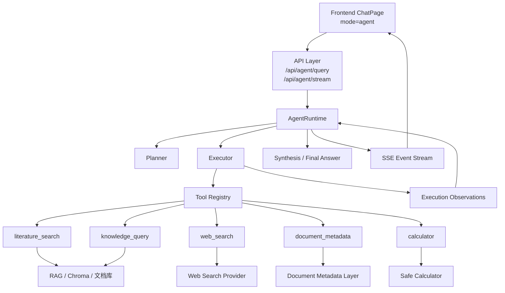
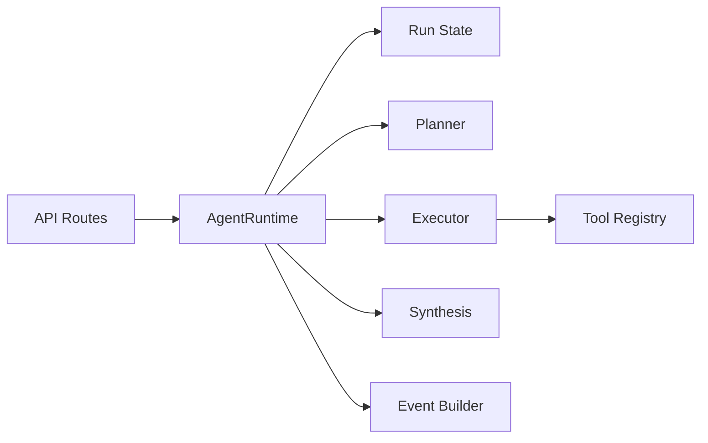
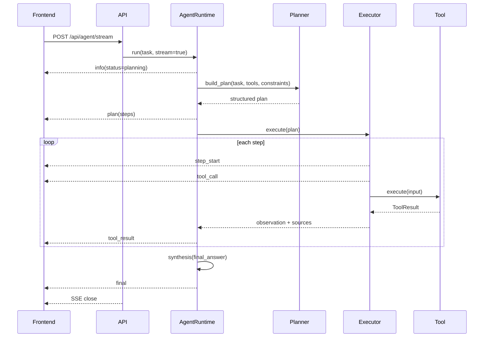
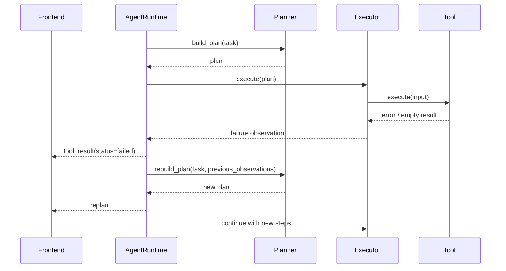
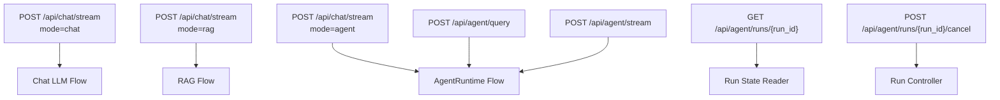
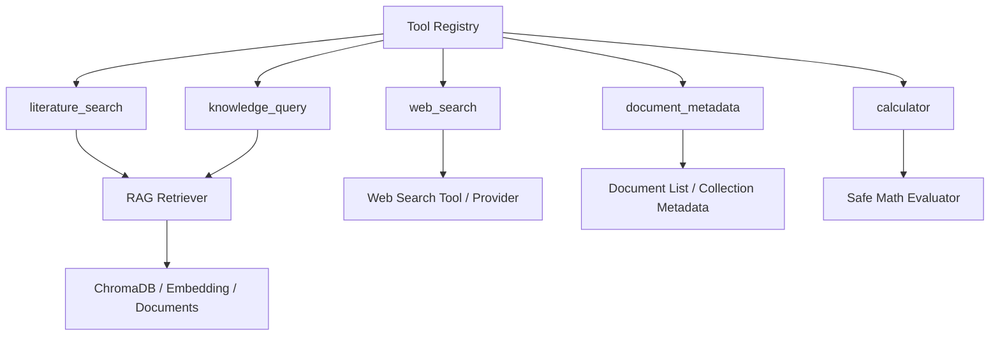
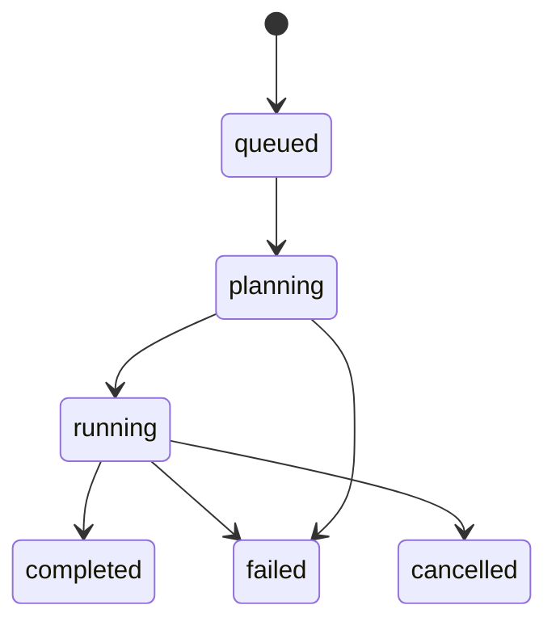
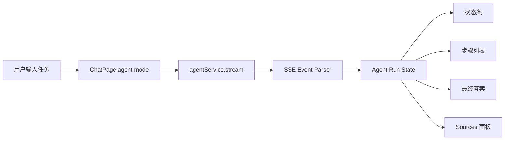

# Agent 架构图文档

## 文档目标

本文档用于从系统结构层面说明 Geo-Agent 单 Agent v1 的关键模块关系，重点讲清楚：

- API 如何进入 Agent Runtime
- Runtime / Planner / Executor / Tools 如何协作
- SSE 事件如何回传前端
- 现有 `chat / rag / agent` 三种模式如何并存

本文档用于架构对齐，同时记录当前代码已经落地的真实运行关系，不替代接口定义和实现规范。

相关文档：

- 总接口文档：`docs/api/agent-frontend-backend.md`
- 后端实现规范：`docs/agent/backend-runtime-spec.md`
- 前端接入规范：`docs/agent/frontend-integration-spec.md`
- 工具开发规范：`docs/agent/tool-development-spec.md`
- 开发总清单：`TODO.md`

---

## 1. 总体架构

Geo-Agent v1 的核心思路是：

1. 前端发起 `agent` 任务
2. API 层把任务交给 `AgentRuntime`
3. `AgentRuntime` 调用 `Planner` 生成结构化计划
4. `Executor` 按步骤调用 `Tool Registry` 中的工具
5. 工具结果形成 `observation`
6. `AgentRuntime` 汇总结果并生成最终答案
7. 执行过程通过 SSE 事件实时返回前端

---

## 2. 模块关系图



---

## 3. 后端内部职责分层



### 职责解释

#### API Routes

负责：

- 接收 HTTP 请求
- 做基础参数校验
- 调用 `AgentRuntime`
- 返回 JSON 或 SSE

不负责：

- 自己做规划
- 自己做工具调用
- 自己拼最终答案

#### AgentRuntime

负责总调度，是 Agent 的唯一编排入口。

负责：

- 初始化 run state
- 调用 planner
- 调用 executor
- 触发 synthesis
- 输出事件和最终结果

#### Planner

负责：

- 把 task 变成结构化 plan
- 做计划合法性校验

不负责：

- 直接执行工具
- 直接返回最终答案

#### Executor

负责：

- 顺序执行 plan steps
- 调工具
- 记录 observation
- 处理局部失败和 replanning

#### Tool Registry

负责：

- 注册工具
- 根据名称查找工具
- 向 planner/runtime 暴露可用工具集合

#### Synthesis

负责：

- 基于 task + observations + sources 生成最终答案

#### Event Builder

负责：

- 将运行状态变成标准 SSE 事件

---

## 4. 运行时序图

### 4.1 正常执行路径



---

### 4.2 失败与重规划路径



---

## 5. API 与 Runtime 的映射关系



### 解释

- `chat` 继续走普通对话链路
- `rag` 继续走显式检索链路
- `agent` 成为正式模式，统一进入 `AgentRuntime`
- 现有 `/api/chat/stream` 中的 `mode=agent` 仅作为兼容入口
- 新增 `/api/agent/*` 作为正式 Agent API

---

## 6. Tool Registry 与底层能力关系图



### 解释

- `Tool Registry` 面向 Agent 暴露统一工具集合
- 各工具内部复用现有能力
- Agent 不直接依赖 `RAGRetriever` 或 `WebSearchTool` 的实现细节
- Agent 只依赖工具抽象

---

## 7. 状态流转图



### 状态说明

- `queued`
  - 请求已进入 runtime，尚未开始规划
- `planning`
  - 正在构建计划
- `running`
  - 正在执行步骤
- `completed`
  - 已成功输出最终答案
- `failed`
  - 运行失败
- `cancelled`
  - 用户或系统主动取消

---

## 8. 前端视角的数据流



### 解释

- 前端不关心 planner 和 executor 内部实现
- 前端只消费标准事件并映射为 UI 状态
- UI 不直接绑定后端内部类，而是绑定稳定的事件协议和响应结构

---

## 9. 当前目录结构与演进点

后端当前核心结构：

```text
src/
  agent/
    __init__.py
    schemas.py
    events.py
    runtime.py
    planner.py
    executor.py
    registry.py
    synthesis.py
```

前端当前核心接入点：

```text
frontend/src/
  services/api.ts
  pages/ChatPage.tsx
  store/
```

---

## 10. 关键设计约束

### 10.1 单一编排入口

所有 Agent 任务必须从 `AgentRuntime` 进入。  
不允许：

- route 自己直接调工具
- planner 直接写最终答案
- executor 绕过 registry 创建工具

### 10.2 工具抽象隔离

Agent 只依赖工具抽象，不依赖底层实现细节。  
这保证后续更换 RAG 或 Web Search 实现时，不需要重写 Agent 核心。

### 10.3 事件协议稳定

前端与后端的耦合点是 SSE 事件协议，而不是 Python 内部对象。  
因此：

- 先稳定事件协议
- 再迭代内部实现

### 10.4 先串行后扩展

v1 先做串行执行，保证链路正确、可调试、可观测。  
多工具并发和多 Agent 协作都不是当前阶段目标。

---

## 11. 当前阶段结论

当前已经完成：

1. `schemas / events / registry`
2. `planner`
3. `executor`
4. `runtime`
5. `/api/agent/*`
6. 前端 `agent` 模式接入

当前后续重点：

1. 继续精修 UI 展示与交互密度
2. 继续增强可靠性与可观测性细节
3. 统一 README、TODO、Notion 的状态表达

---

## 12. 何时算架构对齐完成

当以下问题都不再含糊时，说明架构已经对齐：

- 谁负责规划
- 谁负责执行
- 谁负责工具发现
- 谁负责最终答案生成
- 谁负责状态管理
- 谁负责流式事件输出
- 前端消费什么协议
- `chat / rag / agent` 三种模式如何共存

如果后续开始实现，应该严格以本文档和配套规范为边界，不再在 route 层临时堆逻辑。
